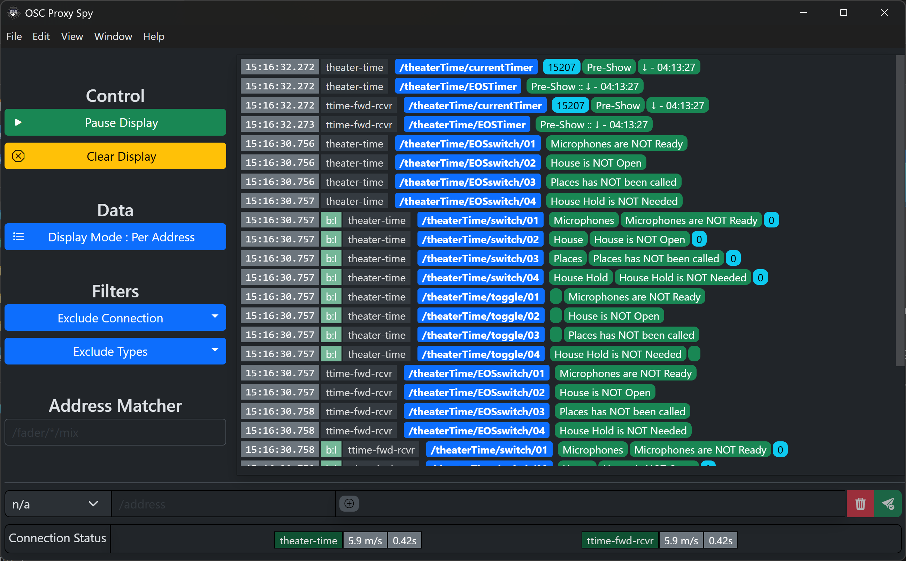
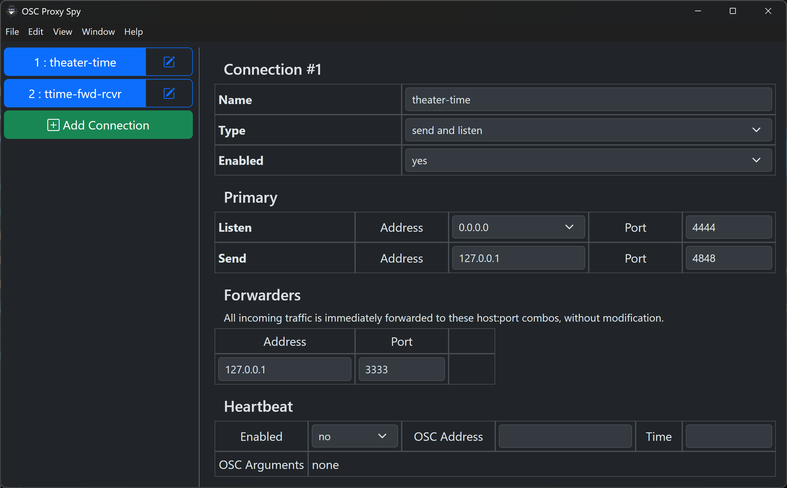

# OSC Proxy Spy

OSC Proxy Spy is a realtime OSC (Open Sound Control) inspector and forwarder.  It's intended audience is developers or theater professionals who need to monitor what OSC messages are coming from an endpoint.  It also has the ability to send an arbitrary OSC packet to an endpoint.

This project is meant for use in a development environment, not in production - it is reasonably stable, but has not been testing in long term operation, and should not be assumed to be stable enough to be a part of a show critical workflow.

The current status of this software should be considered beta - likely it will always be beta software, as the developer does not have enough use for it to produce release candidate quality.

## Capabilities

- Handles all well known, and a lot of obscure OSC data types. (see : [Simple-OSC-Lib](https://github.com/jtsage/node-simple-osc-lib) for types)
- Connections can be send, listen or listen+send.
- Listen and Listen+Send can be forwarded to any number of IP address/port combinations
- Send and Listen+Send connections have an options "Heart Beat" option for sending the same OSC packet constantly on a delay
- Supports filtering by connection, data type, and OSC address.
- Can display each message as it arrives, or group the messages by Connection + OSC Address, updating the data received on each new matching packet.
- IPv4 only, probably forever - few vendor appliances support IPv6 (light boards or sound boards), and it's not worth the extra work.
- UDP only, non-privileged ports only.  TCP support in the future may be possible, privileged ports requires admin OS access, and is a non-trivial problem for electron applications.  The developer has never encountered an OSC device that runs on a privileged port.

## Main Interface

### Controls

- __Pause Display__ - Pause the display.  Data received while paused is discarded
- __Clear Display__ - Clear the output window

- __Display Mode__ - Per Address will update the connection/address with new data when received, otherwise data is printed as it is received.

- __Connection Filter__ - Exclude a connection from the output
- __Type Filter__ - Exclude a type from the output, inclusive - i.e if you exclude 'string' and a message includes multiple arguments, one if which is a string, the message is skipped.
- __Address Matcher__ - Only show messages with a matching address.  Uses the OSC Matching Specification, more information here: [Spec 1.0](https://opensoundcontrol.stanford.edu/spec-1_0.html#osc-message-dispatching-and-pattern-matching). This field is a user entered regex with extra processing, so some additional options are possible.

### Output Window

Messages are shown with a time stamp for when they were received.  The connection name is printed, address in blue, arguments (if any) color coded according to type. Note that empty strings are padded to a single space for display purposes. If the message was received as part of a bundle, the difference between when the packet was received and the time in the time tag is shown, in milliseconds.  Red for bundles from the past, green for bundles from the future.  The special case time tag [0,1] is shown in green as `b:I` (immediate processing).

## Send Section

The send section allows you to craft and send an arbitrary OSC message.  Choose the 'send' or 'send+listen' connection to send to, set an OSC address, and add any required OSC arguments.  The send settings persist through a program restart.

## Status Section

Connection status is shown for listen and send+listen types. It is color coded green when the connection had data in the last 10 seconds, yellow if it has been more than 10 seconds, but some data has been received since the connection was started, and red if no data has ever been received. The first time is an approximation of messages per second on the link, the second time is the time elapsed since the last data was received.

## Settings

### Overview

- __Name__ : Name of the connection, unique identifier suggested.
- __Type__ : 'send', 'send+listen', or 'listen'
- __Enabled__ : 'yes' or 'no'

### Primary

- __Listen Address__ : Interface to listen on, list populated from the operating system.  The special address `0.0.0.0` means "all interfaces"
- __Listen Port__ : UDP port to listen on, 1024-65535
- __Send Address__ : IP Address to send to
- __Send Port__ : UDP port to send to, 1024-65535. Same port sending is supported, it is however unlikely to function as expected for connections on the same interface.  (for instance, the X32 uses this method, but trying to run the X32 simulator on the local host will not work)

### Forwarders

Zero or more IP/port combinations to forward all received traffic to.  Data is sent as-is, no modification or integrity checking is performed.

### Heartbeat

The heartbeat options sends the configured OSC message continuously with a __Time__ delay (in milliseconds) to the primary send address/port. (For instance, the X32 requires `/xremote` to be sent every ~10s)

## License

This is covered under the MIT license, provided as-is with no warranty. Do what you like with it, if you add something useful, consider contributing to the project with the changes.

## A Note About Code Signing

The developer cannot afford to purchase a code signing certificate for this project, so it is unsigned.  This doesn't cause too much of an issue on Windows, but is a hassle on Mac.  A web search will show more detail on running unsigned apps on mac, but you likely need to remove the quarantine flag:

`xattr -r -d com.apple.quarantine /path/to/the/downloaded/app`

&copy; 2026 J.T.Sag
